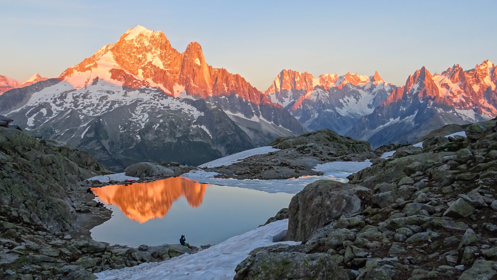
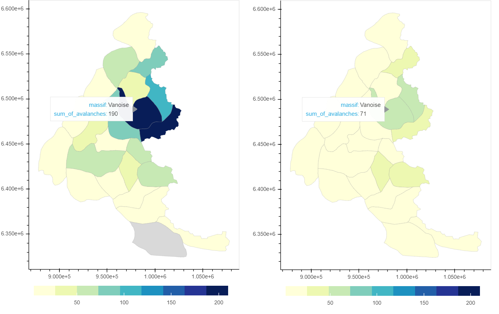

# Avalanche prediction for 22 massifs of French Alps

## by Kamila Hamalcikova

View on Mont Blanc massif from Lac Blanc during sunrise, source: Kamila Hamalcikova

## Dataset

My dataset is compilation of 3 sources:
- 1) multiple Excel and pdf reports about occurence of avalanche accidents in France from winter season 2010/11 till 2019/20. Original reports can be found on [ANENA (Association Nationale pour l’Étude de la Neige et des Avalanches)](https://www.anena.org/5041-bilan-des-accidents.htm) website.
- 2) Excel report about avalanche events from [Data-avalanche.org](http://www.data-avalanche.org/)
- 3) netCDF4 files and shapefiles for various meteo and snow variables from [The S2M meteorological and snow cover reanalysis in the French mountainous areas (1958 - present)](https://en.aeris-data.fr/metadata/?865730e8-edeb-4c6b-ae58-80f95166509b)

## Installation

- Anaconda
- Jupyter Notebook
- Python 3.6
- Python libraries (Pandas, Numpy, Geopandas, Scikit-Learn, Bokeh, Matplotlib,
    Seaborn, Glob, Json, Datetime, Pathlib, NetCDF4, Xarray)
- Flask

## Main findings

- Data exploration: **Avalanche accidents** (with people injured,dead or in need of rescue team) and **avalanche events** (natural events where people might or might not be involved) **are most frequent in March, in altitude from 2000 to 3000 metres**. Avalanche accidents happen most often to groups of 2 people while hiking. Avalanche accidents happen most in Vanoise massif, while avalanche events were most frequent in Haute Maurienne massif.

image of avalanche events (left) and avalanche accidents (right) on the map of French Alps, source: Kamila Hamalcikova/Bokeh

- Avalanche prediction with machine learning:

**Random Forest (RF)** was machine learning model used for prediction of avalanche events and accidents. Results were better when predicting avalanche events because independent variables in dataset were more suitable for it. I was dealing with **strongly imbalanced dataset (99,6 % of cases without avalanche and only 0.4 % with avalanche)**. I focused mainly on recall for days with avalanche and weighted F1 score as performance metrics of RF models, instead of accuracy that is misleading for imbalanced datasets. **The best choice was RF model when removing summer months from the sample. It resulted in 0.58 recall for avalanche days and very high recall 0.9976**. It was minor improvement over baseline values 0.55 from simple RF without feature selection. Other options were RF only on data with limited altitude (1500- 3600 metres), without division into 22 massifs and modification of RF model (Balanced Random Forest), but these variants of machine learning models provided less satisfying results. More details about machine learning part cn be found in my article on [TowardsDataScience.com](https://towardsdatascience.com/random-forest-for-imbalanced-dataset-example-with-avalanches-in-french-alps-77ffa582f68b).

**XGBoost (XGB)** was used only for predicition of avalanche events. **This model again showed that the best option for predicition is removing summer months from sample.** Moreover, this XGB provided significantly better recall for avalanche days over Random Forest (0.8-0.9 instead of 0.58 from RF). F1-score of XGB was lower (0.992-0.995 instead of 0.997-0.998 for RF). This was due too slightly lower metrics like recall for days without avalanche and precision of avalanche days. But these metrics has way lower importance then recall for avalanche days, **therefore XGBoost is far better in prediction of avalanches than Random Forest**.

## How to run the code

- Data exploration: in files **avalanche_events_EDA.ipynb** and **avalanche_accidents_EDA.ipynb**, or png.images can be displayed without checking ipynb files.

- Avalanche prediction with machine learning: In order to repeat data wrangling of my final dataset, you need to download source nc files from The S2M meteorological and snow cover reanalysis (link above) and then run folowwing files in this order:
    1) scripts in **year_select.py** and **one_year_meteo.py** to get data about meteo variables into csv files for different years
    2) **snow_variables.ipynb** to get data about snow variables into csv file, **meteo_variables.ipynb** to get data about meteo variables into final csv file and merge it with snow variables data
    3) **final_merge.ipynb** to get final dataset for machine learning
    4) **random_forest_avalanche_events_v2_final.ipynb** and **random_forest_avalanche_accidents.ipynb** to get results of Random Forest model and **xgboost_avalanche_events.ipynb** to get results of XGBoost model.

- Flask app: in folder Flask app (if you are not familiar with Flask, you can view video of the app [here](https://www.youtube.com/watch?v=-0ov6QQifV8&ab_channel=KamilaHamalcikova) or simply check [this website](https://avalanche-danger-index.herokuapp.com/), where app is stored.

## License

This project is licensed under the MIT License - see the [license](https://opensource.org/licenses/MIT) file for details

## Sources

- [ANENA](https://www.anena.org/5041-bilan-des-accidents.htm#par42276):  for avalanche accidents reports
- [The S2M meteorological and snow cover reanalysis in the French mountainous areas (1958 - present) ](https://en.aeris-data.fr/metadata/?865730e8-edeb-4c6b-ae58-80f95166509b): for snow and meteo variables
- [Data-avalanche.org](http://www.data-avalanche.org/):  for avalanche events reports
- [Bagging and Random Forest for Imbalanced Classification](https://machinelearningmastery.com/bagging-and-random-forest-for-imbalanced-classification/): for dealing with imbalanced dataset
- [Growing RForest - 97% Recall and 100% Precision](https://www.kaggle.com/palmbook/growing-rforest-97-recall-and-100-precision): for ways how to improve recall
- [Implementing a Random Forest Classification Model in Python](https://medium.com/@hjhuney/implementing-a-random-forest-classification-model-in-python-583891c99652): for Random forest model
- [Adding CSS styling to your website](https://pythonhow.com/add-css-to-flask-website/): for changes in CSS styles
- [Build a Python Web Server with Flask](https://projects.raspberrypi.org/en/projects/python-web-server-with-flask): for building Flask app
